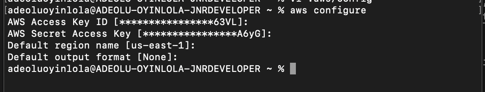
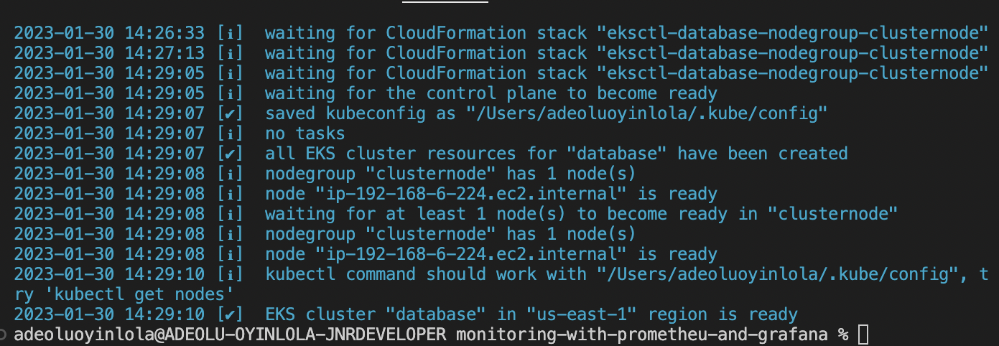
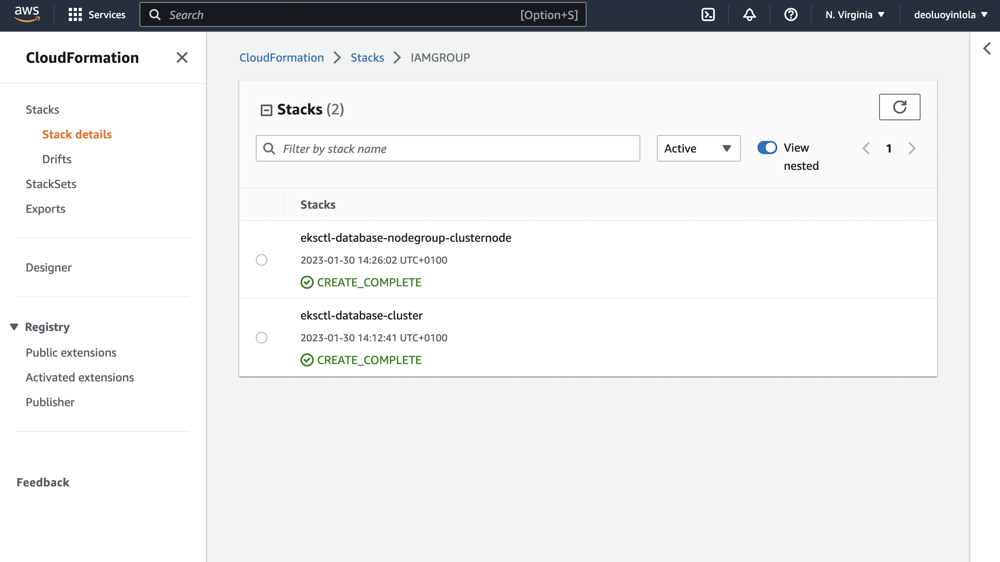
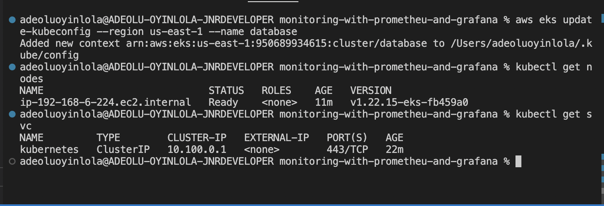

# monitoring-with-prometheu-and-grafana
A demo of how I provisioned kubernetes cluster with eksctl, manage microservices with kubernetes, helm chart and monitoring with prometheus and grafana.

**Contents** <a name="Contents"></a>
* [Tools](#Tools)
* [Demo](#Demo)
  * [Provision of Infrastruture](#Provision-of-Infrastruture)
  * [Deployment of Microservices](#Deployment-of-Microservices)
  * [Monitoring the System](#Monitoring-the-System)
  * [Monitor the application](#Monitor-the-application)
* [Resources](#Resources)

[Back to Contents](#Contents)

## Tools
- [aws](https://aws.amazon.com/) - cloud platform, offers reliable, scalable, and inexpensive cloud computing services.
- [aws cli](https://docs.aws.amazon.com/cli/latest/userguide/getting-started-install.html)  - a unified tool to manage your AWS services.
- [VSCode](https://code.visualstudio.com/) - a source-code editor made by Microsoft with the Electron Framework, for Windows, Linux and macOS.
- [helm](https://helm.sh/) - Helm helps you manage Kubernetes applications — Helm Charts help you define, install, and upgrade even the most complex Kubernetes application.
- [eksctl](https://eksctl.io/) - a simple CLI tool for creating and managing clusters on EKS - Amazon's managed Kubernetes service for EC2.
- [prometheus](https://prometheus.io/docs/introduction/overview/) - An open-source monitoring system with a dimensional data model, flexible query language, efficient time series database and modern alerting approach.
- [grafana](https://grafana.com/docs/grafana/latest/) - Operational dashboards for your data

## Demo
The architecture flow this pattern;
Git --> GitHub --> eskctl --> helmfile --> kubernetes cluster --> prometheus --> Grafana

## Stage 1 - Provision of Infrastruture
- Step 1: Programmatic access; 

- Step 2: Install and configure kubectl, AWS CLI and eksctl. [Link to How](https://docs.aws.amazon.com/eks/latest/userguide/getting-started.html). Be careful to set and utilise profile name when working with multiple accounts in your machine.
- Step 3: Creating cluster with (1.) a name (2.) version 1.22 (3.) nodegroup name, type and number in a specify region. Run the command; 
```
eksctl create cluster --name database --version 1.22 --nodegroup-name clusternode --node-type t3.micro --nodes 1 --managed
```

- Step 4; Check Cloudformation and eks from aws management console


With this command, we have successfuly create a eks cluster with a node.

#### Configure kubectl to communicate with cluster
- Step 1; Configure your computer to communicate with your cluster;
```
aws eks update-kubeconfig --region us-east-1 --name database
```

- Step 2; Confirm your context and test your configuration. Run this command to list your contexts;
```
kubectl config get-contexts
```
- and this following commands to check your configuration;
```
kubectl get nodes
```
```
kubectl get svc
```



[Back to Contents](#Contents)

## Resources


[Back to Contents](#Contents)